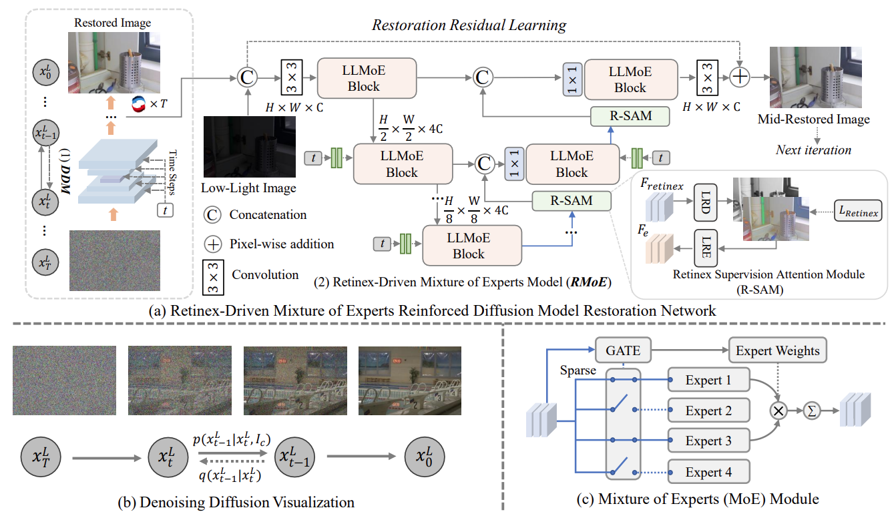

# [TPAMI 2025] Diff-Retinex++: Retinex-Driven Reinforced Diffusion Model for Low-Light Image Enhancement
### [Paper](https://ieeexplore.ieee.org/abstract/document/10974676) | [Code](https://github.com/XunpengYi/Diff-Retinex-Plus) 

**Diff-Retinex++: Retinex-Driven Reinforced Diffusion Model for Low-Light Image Enhancement**
Xunpeng Yi, Han Xu, Hao Zhang, Linfeng Tang and Jiayi Ma in TPAMI 2025




## 1. Create Environment
- Create Conda Environment
```
conda env create -f environment.yaml
conda activate diff_retinex_plus_env
```
- Install BasicSR
```
pip install basicsr==1.3.4.4
```

## 2. Prepare Your Dataset
Please download the datasets from the following links: [lolv1](https://daooshee.github.io/BMVC2018website/), [lolv2 real/syn](https://github.com/flyywh/CVPR-2020-Semi-Low-Light), [LSRW](https://github.com/JianghaiSCU/R2RNet#dataset).

For the LLRW dataset, you can download it from [[Google Drive]](https://drive.google.com/drive/folders/19Ulq-hanwKitZvp3LpXTuNa8mxNWVJym?usp=sharing) | [[Baidu Drive]](https://pan.baidu.com/s/1ylwJDFp-CHZ6NizHwtsZuw) (code: ra4u).

The A-LLIE dataset is composed of challenging scenes collected from existing datasets and requires a redistribution license. You can obtain it from the corresponding original sources.

## 3. Pretrained Weights
Please download the weights and place them in the `pretrained_weights` folder.

The pretrained weight for lolv1 dataset is at [[Google Drive]](https://drive.google.com/drive/folders/1noF5hwnduC2-IG5FaSYZr303u3atWYM-?usp=sharing) | [[Baidu Drive]](https://pan.baidu.com/s/1r_7vjpS6XO7saemlQlYepQ) (code: 1ucp).

The pretrained weight for lolv2 real dataset is at [[Google Drive]](https://drive.google.com/drive/folders/1HVcX2YW5XKjKIiqKibJMmYV1bCorswxt?usp=sharing) | [[Baidu Drive]](https://pan.baidu.com/s/1maR_XS0rpbgDkyOi2UYbsw) (code: vmwa).

The pretrained weight for lolv2 syn dataset is at [[Google Drive]](https://drive.google.com/drive/folders/1nvdPQOIRcuidYwkXBsG2KDs7eLH-ErmL?usp=sharing) | [[Baidu Drive]](https://pan.baidu.com/s/1gLidotuCYLFx7bIXxTNR6w) (code: kzii).

The pretrained weight for LSRW dataset is at [[Google Drive]](https://drive.google.com/drive/folders/19q3a1cSu51Id9MHfn8xPVsS4Aimv5gQw?usp=sharing) | [[Baidu Drive]](https://pan.baidu.com/s/1bIv1NRdEQEqnDF7GevCZsQ) (code: 21gt).

The pretrained weight for A-LLIE dataset is at [[Google Drive]](https://drive.google.com/drive/folders/1qUfOM_1c4UEbrZv1F9NTwD_nCDcUiD88?usp=sharing) | [[Baidu Drive]](https://pan.baidu.com/s/1p04RgJ6utQ58irSzySInyg) (code: ymjd).

## 4. Testing
Run the following commands:
```shell
# lolv1
CUDA_VISIBLE_DEVICES=0 python test.py -opt "options/test_diff_retinex_plus_lolv1.yml"

# lolv2 real
CUDA_VISIBLE_DEVICES=0 python test.py -opt "options/test_diff_retinex_plus_lolv2_real.yml"

# lolv2 syn
CUDA_VISIBLE_DEVICES=0 python test.py -opt "options/test_diff_retinex_plus_lolv2_syn.yml"

# LSRW Huawei (need 640×480 resolution with VRAM 24G)
CUDA_VISIBLE_DEVICES=0 python test.py -opt "options/test_diff_retinex_plus_lsrw_huawei.yml"

# LSRW Nikon (need 640×480 resolution with VRAM 24G)
CUDA_VISIBLE_DEVICES=0 python test.py -opt "options/test_diff_retinex_plus_lsrw_nikon.yml"
```
Diff-Retinex++ also support ultra-high-definition (UHD) image inference:
```shell
# UHD Image
CUDA_VISIBLE_DEVICES=0 python test_UHD.py -opt "options/test_diff_retinex_plus_UHD.yml"
```
Due to the inherent randomness of diffusion model, the performance may slightly vary depending on the hardware and software environment. We recommend using the RTX 4090 for inference testing to ensure the original performance can be replicated as closely as possible.

## 5. Training
1. To begin with, modify the dataset path in `decom_tools/train_decom.py`. And train the Retinex decomposition network by running the following command to prepare the weights:
```shell
cd ./decom_tools
python train_decom.py
```
 The weight is at `./decom_tools/experiments` after training. It is only required during training stage.

2. Next, specify the path to the pretrained Retinex decomposition network (`network_decom: path:`) in the corresponding configuration file under `options/`, then return to the root directory and run the following commands to train RMoE:

```shell
# lolv1
CUDA_VISIBLE_DEVICES=0,1 python -m torch.distributed.launch --nproc_per_node=2 --master_port=2982 train.py -opt options/train_diff_retinex_plus_lolv1.yml --launcher pytorch

# lolv2 real
CUDA_VISIBLE_DEVICES=0,1 python -m torch.distributed.launch --nproc_per_node=2 --master_port=2982 train.py -opt options/train_diff_retinex_plus_lolv2_real.yml --launcher pytorch

# lolv2 syn
CUDA_VISIBLE_DEVICES=0,1 python -m torch.distributed.launch --nproc_per_node=2 --master_port=2982 train.py -opt options/train_diff_retinex_plus_lolv2_syn.yml --launcher pytorch

# LSRW
CUDA_VISIBLE_DEVICES=0,1 python -m torch.distributed.launch --nproc_per_node=2 --master_port=2982 train.py -opt options/train_diff_retinex_plus_lsrw.yml --launcher pytorch

# A-LLIE
CUDA_VISIBLE_DEVICES=0,1 python -m torch.distributed.launch --nproc_per_node=2 --master_port=2982 train.py -opt options/train_diff_retinex_plus_A_LLIE.yml --launcher pytorch
```

We strongly recommend using at least two GPUs, each equipped with 24 GB or more of VRAM, to ensure efficient training.

## Citation
If you find our work or dataset useful for your research, please cite our paper. 
```
@article{yi2025diff,
  title={Diff-Retinex++: Retinex-Driven Reinforced Diffusion Model for Low-Light Image Enhancement},
  author={Yi, Xunpeng and Xu, Han and Zhang, Hao and Tang, Linfeng and Ma, Jiayi},
  journal={IEEE Transactions on Pattern Analysis and Machine Intelligence},
  year={2025},
  publisher={IEEE}
}
```
This code is built on [BasicSR](https://github.com/XPixelGroup/BasicSR). During the implementation process, we referred to many excellent works, such as Restormer, SR3, PyDiff, GSAD etc. Here we express our gratitude to them.
If you have any questions, please send an email to xpyi2008@163.com. 